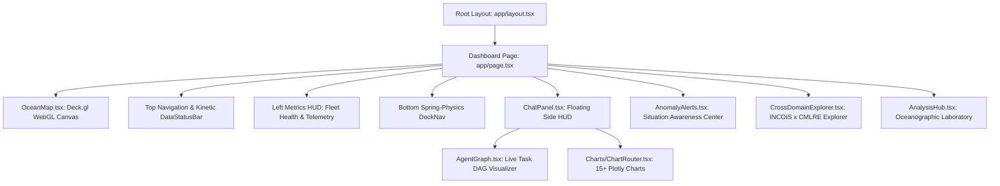

# VARUNA Technical Architecture — 08. Frontend Operations Center

> **Design Aesthetic**: Military/Scientific Oceanographic Command Center with Bioluminescent Liquid Glass HUD.  
> **Key Frameworks**: Next.js 14 (App Router), Deck.gl v9, Mapbox GL JS v3, Three.js, React-Plotly.js, Framer Motion, TailwindCSS v3.

---

## 1. UI Hierarchy & Component Architecture



---

## 2. Views & Operation Modes

### 1. Situational Fleet Map (`MAP` View)
- Renders full-screen interactive Mapbox canvas with dark navy bathymetry.
- **ARGO Layer**: 3,800+ real-time float nodes rendered via Deck.gl `ScatterplotLayer`. Clicking any float reveals its 10-day profile history and deep water sensor readings.
- **Biodiversity Layer**: Overlay of CMLRE species occurrence records color-coded by phylum/family.
- **Float Trajectories**: 90-day drift vectors rendered using Deck.gl `PathLayer`.

### 2. Scientific Analysis Hub (`ANALYSIS` View)
Comprehensive oceanographic laboratory rendering 15+ Plotly charts:
- **Depth Profiles** ($T, S, O_2$ vs depth $0-2000\text{m}$)
- **Hovmöller Diagrams** (Time vs Depth heatmaps)
- **T-S Diagrams with UNESCO Isopycnals** (Water mass identification)
- **3D Bathymetric Surface Plots**
- **BGC Correlation Scatter Plots** (Chlorophyll vs Nitrate, $O_2$ vs Temp)

### 3. Proactive Early-Warning Center (`ALERTS` View)
- Dedicated feed of live Marine Heatwave and hypoxia alerts flagged by the background Anomaly Agent.
- Displays severity gauge, affected ocean basin boundaries, species vulnerability warnings, and fisheries policy advisories.

### 4. INCOIS ↔ CMLRE Cross-Domain Explorer (`BIODIVERSITY` View)
- Interactive environmental envelope analysis: correlates sea surface temperatures and oxygen levels with known species distributions (e.g. *Sardinella longiceps*, *Acropora* corals).

---

## 3. Design Tokens & Visual Standards

```css
/* Deep Ocean Base */
--bg: #071A2D;                /* Midnight Water */
--bg-1: #0A2540;              /* Deep Ocean Blue */
--bg-2: #051421;              /* Abyss Blue */

/* Interactive & AI Accents */
--accent: #2EE6C6;            /* Tropical Aqua */
--accent-secondary: #1ECBE1;   /* Ocean Cyan */
--glow: #00FFC6;              /* Bioluminescent Green */

/* Contrast Warnings */
--coral: #FF7F50;             /* Coral Orange */
--coral-dim: #FF6B6B;         /* Reef Red */
--text: #D6F6FF;              /* Soft Ice Blue */
```
