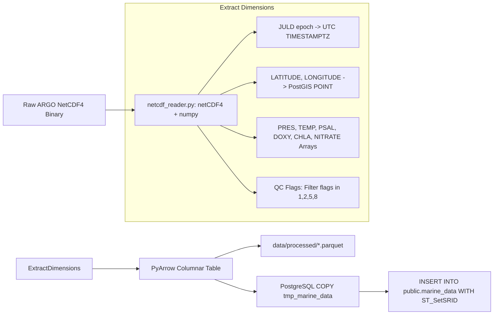

# Member 2: Aditya Yadav (Backend & Data Infrastructure Lead)
**Role**: Data Engineer & Backend Infrastructure Lead  
**Focus Areas**: NetCDF HPC Extraction, PyArrow & Parquet Columnar Storage, PostgreSQL PostGIS Spatial Layer, CMLRE Darwin Core Seeding, Auth & Security  

---

## 1. Executive Summary & Ownership Boundaries
Member 2 owns the raw data ingestion pipeline, spatial relational database schema, and biodiversity dataset seeding for VARUNA:
1. **NetCDF Ingestion Engine**: High-performance extraction of ARGO multi-dimensional float arrays (`N_PROF`, `N_PARAM`, `N_LEVELS`) from IFREMER / INCOIS GDAC servers, resolving Data Assembly Centre (DAC) metadata and sensor QC flags.
2. **PostgreSQL & PostGIS Database Schema**: Production table architecture for `public.marine_data`, `public.marine_biodiversity`, `public.floats`, and `public.anomaly_alerts`, including range partitioning by year and GIST spatial indexing.
3. **CMLRE Marine Living Resources Seed Pipeline**: Ingesting and formatting 500+ Indian Ocean marine species occurrences according to the TDWG Darwin Core standard (`dwc:scientificName`, `dwc:decimalLatitude`, `dwc:eventDate`).
4. **Spatial-Temporal Join Acceleration**: Optimized PostGIS queries (`ST_DWithin`, KNN `<->` spatial operator) for correlating physical ocean float measurements with biological species distributions.

---

## 2. Work Allocation: What to Review vs. What to Build

### 🔍 What to REVIEW (Existing Code — Requires Heavy/High Critical Review)
1. **`src/database/postgres.py` [HIGH REVIEW]**:
   - Check connection pool resilience when running in offline/local environments without PostgreSQL.
   - Verify that spatial geography columns use SRID 4326 and that GIST indexes are properly leveraged during distance queries.
   - Ensure parameterized execution on all functions (zero f-string SQL).
2. **`src/ingestion/netcdf_reader.py` [HEAVY REVIEW]**:
   - Verify array dimension slicing for multi-profile files (`N_PROF > 1`).
   - Validate that JULD epoch calculation (`1950-01-01`) properly handles float time offsets.
   - Verify that sensor QC flags in `[1, 2, 5, 8]` are preserved while bad data flags `[3, 4, 9]` are converted to `NULL`.
3. **`src/ingestion/pipeline.py` [HIGH REVIEW]**:
   - Inspect PostgreSQL `COPY` buffer mechanism and verify temporary staging table handles primary key collisions gracefully (`ON CONFLICT DO NOTHING`).
4. **`src/database/duckdb_client.py` [HIGH REVIEW]**:
   - Review Parquet query performance and verify that memory limits are respected.

### 🔨 What to BUILD (New Code)
1. **`src/ingestion/seed_biodiversity.py` [COMPLETELY NEW]**:
   - Author complete seeder script inserting 500+ Indian Ocean species occurrences (*Sardinella longiceps*, *Rastrelliger kanagurta*, *Acropora millepora*, *Thunnus albacares*, *Dugong dugon*) with valid Darwin Core columns and spatial coordinates.
2. **`init_biodiversity_schema()` in `postgres.py` [COMPLETELY NEW]**:
   - DDL for `public.marine_biodiversity` with GIST index on `geom` and B-tree index on `(scientific_name, event_date)`.
3. **`correlate_species_with_ocean()` in `postgres.py` [COMPLETELY NEW]**:
   - Lateral join query finding nearest ARGO profiles within 50km and 7 days.

---

## 3. Technical Specifications & Implementation Blueprints

### 3.1 NetCDF Dimensionality & QC Masking ETL

---

## 4. Daily Milestone & Deliverable Checklist (Aug 15 - Aug 24)

- [ ] **Day 1 (Aug 15)**: Implement `init_biodiversity_schema()` in `postgres.py` with spatial GIST indexes and constraints.
- [ ] **Day 2 (Aug 16)**: Write `seed_biodiversity.py` with 500+ real Darwin Core records for key Indian Ocean species.
- [ ] **Day 3 (Aug 17)**: Implement `correlate_species_with_ocean()` and `get_species_near_float()` spatial functions.
- [ ] **Day 4 (Aug 18)**: Test NetCDF batch ingestion pipeline with sample Indian Ocean ARGO profile NetCDF files.
- [ ] **Day 5 (Aug 19)**: Optimize PostGIS query plans with `EXPLAIN ANALYZE` ensuring sub-15ms index scan latencies.
- [ ] **Day 6 (Aug 20)**: Implement API rate-limiting and security middleware in `app.py`.
- [ ] **Day 7 (Aug 21)**: Validate database connection pool resilience under 50 concurrent simulated client queries.
- [ ] **Day 8 (Aug 22)**: Prepare database snapshot & seed verification script.
- [ ] **Day 9 (Aug 23)**: Complete backend performance benchmark report.
- [ ] **Day 10 (Aug 24)**: Hackathon Kickoff & Live Defense.
