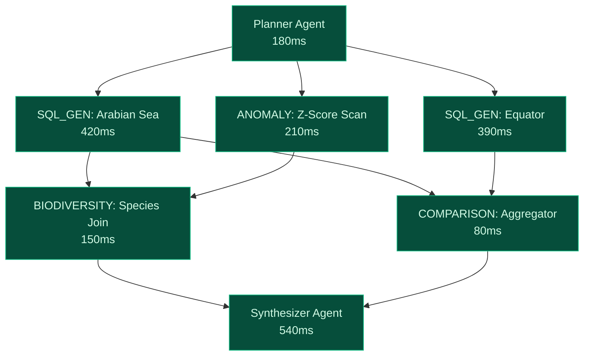

# Member 4: Advay Chavan (Frontend Full-Stack & UI Systems Lead)
**Role**: Frontend Full-Stack Engineer & Interaction Systems Lead  
**Focus Areas**: Next.js 14 App Router, Ocean Copilot Chat Interface, Live Agent Execution DAG Visualizer, 3D Bioluminescent WebGL Globe, State Management  

---

## 1. Executive Summary & Ownership Boundaries
Member 4 is responsible for the interactive command center experience of VARUNA:
1. **Next.js 14 App Shell & Navigation Dock**: Fluid Apple/Palantir-grade HUD with spring-physics dock navigation, live data status telemetry, and responsive glassmorphism containers.
2. **Ocean Copilot Chat Panel**: WebSocket-enabled streaming conversational interface with syntax-highlighted SQL execution drawers, starter prompt chips, and multi-agent reasoning badges.
3. **Live Agent Execution Graph (`AgentGraph.tsx`)**: Real-time visualization of the Multi-Agent Task DAG (showing Planner decomposition, sub-agent dispatch states, parallel execution timings, and dependencies).
4. **3D WebGL Ocean Globe**: Three.js / `@react-three/fiber` interactive globe visualizing the Indian Ocean ARGO float fleet with depth bathymetry and bioluminescent pulse effects.

---

## 2. File Ownership & Code Contracts

### Primary Files Owned
- `frontend/app/page.tsx` [EXTEND - VARUNA rebrand, view switcher, HUD overlays]
- `frontend/app/layout.tsx` [MAINTAIN - Root HTML metadata, custom fonts]
- `frontend/components/ChatPanel.tsx` [EXTEND - Agent DAG rendering, copyable SQL blocks]
- `frontend/components/AgentGraph.tsx` [NEW - Interactive DAG visualizer]
- `frontend/components/Globe/OceanGlobe.tsx` [MAINTAIN - Three.js WebGL globe]
- `frontend/components/DebugPanel/` [MAINTAIN - Pipeline trace inspector]
- `frontend/hooks/useChatStream.ts` [EXTEND - Agent trace data streaming]

---

## 3. Technical Specifications & Implementation Blueprints

### 3.1 Live Agent Execution DAG Visualizer (`frontend/components/AgentGraph.tsx`)

When the backend returns an `agent_trace` from `/api/v1/agent/chat`, the `AgentGraph` renders the live execution workflow:



#### Component Interface (`AgentGraph.tsx`):
```tsx
export interface AgentTaskStep {
  task_id: string;
  agent_type: "PLANNER" | "SQL_GEN" | "RETRIEVAL" | "BIODIVERSITY" | "ANOMALY" | "COMPARISON" | "SYNTHESIZER";
  description: string;
  status: "PENDING" | "RUNNING" | "COMPLETED" | "FAILED";
  duration_ms?: number;
  result_summary?: string;
  dependencies?: string[];
}

export interface AgentGraphProps {
  planId?: string;
  steps: AgentTaskStep[];
  isExecuting?: boolean;
}
```

---

### 3.2 Design System Tokens & Fluid Glassmorphism

Advay ensures compliance with VARUNA's strict, award-winning dark ocean design system (in `globals.css`):
- **Liquid Glass (`.glass`)**: `backdrop-filter: blur(20px) saturate(180%)`, physical edge light refraction (`inset 0 1px 0 rgba(255,255,255,0.08)`).
- **Zero AI Slop**: No generic floating purple gradients. Every visual element reflects ocean physics (depth stratification, bioluminescent green `#00FFC6`, tropical aqua `#2EE6C6`, deep abyss `#051421`).
- **Micro-Animations**: Framer Motion spring physics on dock navigation, skeleton shimmers during streaming, kinetic marquee on status bar.

---

## 4. Daily Milestone & Deliverable Checklist (Aug 15 - Aug 24)

- [ ] **Day 1 (Aug 15)**: Rebrand `frontend/app/page.tsx` to **VARUNA — Marine Ecosystem Intelligence Platform**, wire HUD tabs.
- [ ] **Day 2 (Aug 16)**: Build `frontend/components/AgentGraph.tsx` with animated task nodes, duration badges, and status pulses.
- [ ] **Day 3 (Aug 17)**: Update `ChatPanel.tsx` with dual mode toggle: **Quick Query (Single-Shot)** vs **Agentic Orchestrator (Multi-Step DAG)**.
- [ ] **Day 4 (Aug 18)**: Integrate `useChatStream.ts` with `/api/v1/agent/chat` streaming response payload.
- [ ] **Day 5 (Aug 19)**: Build expandable SQL Query Inspector inside chat responses with 1-click execution copy.
- [ ] **Day 6 (Aug 20)**: Optimize Three.js 3D Globe rendering performance (target 60 FPS on laptop GPUs).
- [ ] **Day 7 (Aug 21)**: UI audit: ensure zero layout shifts, zero console warnings, and flawless mobile/desktop responsiveness.
- [ ] **Day 8 (Aug 22)**: Polish micro-interactions, keyboard shortcuts (`Cmd+K` / `Ctrl+K` command palette), and theme transitions.
- [ ] **Day 9 (Aug 23)**: Final production build validation (`npm run build` with zero TypeScript errors).
- [ ] **Day 10 (Aug 24)**: Hackathon Kickoff & Live UI Defense.
