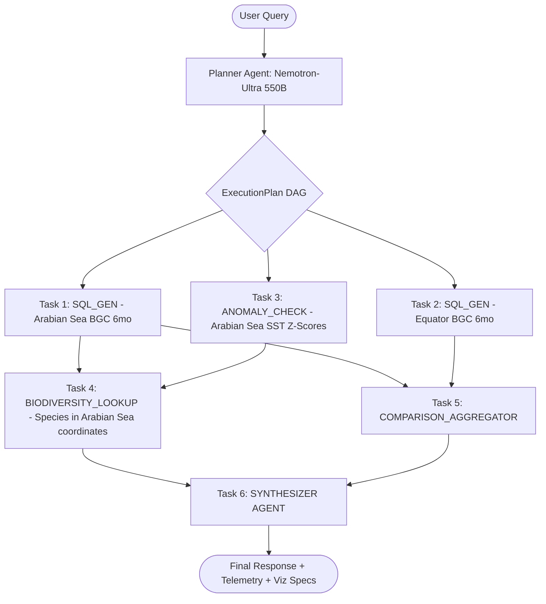

# Member 1: Aryan Lomte (Lead Architect & AI Systems Engineer)
**Role**: Team Lead, AI Systems Architect, Backend Core Lead  
**Focus Areas**: Multi-Agent Task DAG Orchestration, Proactive Anomaly Agent, Synthesizer Agent, API Gateway Routing, System Governance  

---

## 1. Executive Summary & Ownership Boundaries
As the Team Lead and AI Systems Architect, Member 1 is responsible for the central nervous system of VARUNA:
1. **Multi-Agent Task DAG Orchestrator**: The engine that transforms complex, multi-variable, cross-domain natural language prompts into executable DAGs (Directed Acyclic Graphs), dispatches tasks to specialized sub-agents, and resolves dependencies asynchronously.
2. **Marine Anomaly & Early-Warning Agent**: Autonomous background engine performing statistical anomaly scanning (Hobday et al. 2016 Marine Heatwave definition, Hypoxia thresholds, Chlorophyll anomalies) over real-time and historical physical ocean data.
3. **Synthesizer Agent**: Deterministic aggregation and grounded natural language response generator that enforces 100% data provenance (every number traces back to a SQL row or observation ID).
4. **API Gateway & Core Router**: FastAPI application lifecycle, REST endpoints (`/api/v1/agent/chat`, `/api/v1/anomalies`, `/api/v1/correlate`), WebSocket streaming orchestration, and pipeline observability telemetry.

---

## 2. File Ownership & Code Contracts

### Primary Files Owned
- `backend/src/agents/orchestrator.py` [NEW - Core Orchestrator]
- `backend/src/agents/anomaly_agent.py` [NEW - Background Anomaly Scanner]
- `backend/src/agents/synthesizer_agent.py` [NEW - Grounded Synthesizer]
- `backend/src/api/routes.py` [EXTEND - Agent endpoints, anomaly feeds]
- `backend/src/api/app.py` [MAINTAIN - Lifespan events, CORS, middleware]
- `backend/src/observability/tracer.py` [MAINTAIN - Pipeline trace telemetry]
- `VARUNA.md` & `docs/` [GOVERN - Architecture and system standards]

---

## 3. Technical Specifications & Implementation Blueprints

### 3.1 Multi-Agent Task DAG Orchestrator (`backend/src/agents/orchestrator.py`)

#### DAG Decomposition Logic
When a user asks:
> *"Compare dissolved oxygen and chlorophyll trends in the Arabian Sea over the last 6 months against the equatorial Indian Ocean, and identify if any local pelagic fish or coral species were affected by the recent thermal anomalies."*

The single-shot approach (OceanIQ) fails because no single SQL query can join unstructured taxonomic text, multiple temporal aggregations across disparate bounding boxes, and statistical anomaly thresholds.

The Orchestrator executes the following Task DAG:



#### Code Contract (`orchestrator.py`):
```python
from __future__ import annotations
from typing import Any, Dict, List, Optional
from pydantic import BaseModel, Field

class AgentTask(BaseModel):
    task_id: str
    agent_type: str  # 'SQL_GEN' | 'RETRIEVAL' | 'BIODIVERSITY' | 'ANOMALY' | 'COMPARISON' | 'SYNTHESIZER'
    description: str
    params: Dict[str, Any] = Field(default_factory=dict)
    dependencies: List[str] = Field(default_factory=list)
    status: str = 'PENDING'  # 'PENDING' | 'RUNNING' | 'COMPLETED' | 'FAILED'
    result: Optional[Any] = None
    execution_time_ms: float = 0.0

class ExecutionPlan(BaseModel):
    query: str
    plan_id: str
    tasks: List[AgentTask]
    estimated_cost_tokens: int = 0

class AgentExecutionTrace(BaseModel):
    plan_id: str
    original_query: str
    tasks: List[AgentTask]
    total_latency_ms: float
    synthesized_output: str
```

---

### 3.2 Proactive Marine Anomaly & Early-Warning Agent (`backend/src/agents/anomaly_agent.py`)

#### Statistical Anomaly Formulation
1. **Marine Heatwave (MHW) Threshold**:
   Let $T(x, y, t)$ be the sea surface temperature at coordinates $(x, y)$ on day $t$.
   The 30-year climatological baseline is $\mu_{clim}(x, y, d)$ and 90th percentile threshold is $P_{90}(x, y, d)$ where $d = \text{day of year} \pm 5\text{ days}$.
   $$\text{MHW Intensity Anomaly: } I_{MHW}(t) = T(x, y, t) - \mu_{clim}(x, y, d)$$
   $$\text{Condition: } T(x, y, t) > P_{90}(x, y, d) \quad \forall t \in [t_0, t_0 + N], \quad N \ge 5\text{ days}$$
2. **Hypoxia Alert Threshold**:
   $$\text{DOXY} < 60.0\,\mu\text{mol/kg} \quad (\text{Suboxic: } \text{DOXY} < 20.0\,\mu\text{mol/kg})$$

#### Autonomous Background Worker Blueprint
- Runs inside the FastAPI process using an asynchronous background loop.
- Executes every 6 hours against active PostgreSQL tables.
- Emits structured alerts to `public.anomaly_alerts` with severity levels:
  - `CRITICAL`: Anomaly $> +3.5^\circ\text{C}$ or DOXY $< 20\,\mu\text{mol/kg}$
  - `HIGH`: Anomaly $> +2.0^\circ\text{C}$ or DOXY $< 60\,\mu\text{mol/kg}$
  - `MODERATE`: Anomaly $> +1.2^\circ\text{C}$
  - `ADVISORY`: Emerging thermal trend $> +0.8^\circ\text{C}$

---

## 4. Daily Milestone & Deliverable Checklist (Aug 15 - Aug 24)

- [ ] **Day 1 (Aug 15)**: Initialize `backend/src/agents/` package, write `orchestrator.py` Task DAG parsing and topological execution engine.
- [ ] **Day 2 (Aug 16)**: Implement `synthesizer_agent.py` with strict numerical citation validation against SQL query outputs.
- [ ] **Day 3 (Aug 17)**: Build `anomaly_agent.py` background scanner with 30-day rolling baseline calculation and MHW detection.
- [ ] **Day 4 (Aug 18)**: Integrate `/api/v1/agent/chat` and `/api/v1/anomalies` into `backend/src/api/routes.py`.
- [ ] **Day 5 (Aug 19)**: End-to-end multi-agent pipeline testing with complex compound queries (Physical + Biodiversity).
- [ ] **Day 6 (Aug 20)**: Telemetry and latency optimization (parallel sub-agent execution via `asyncio.gather`).
- [ ] **Day 7 (Aug 21)**: Full cross-domain integration review with M2 (Aditya) and M3 (Sahil).
- [ ] **Day 8 (Aug 22)**: Stress testing, offline fallback verification, API rate-limiting validation.
- [ ] **Day 9 (Aug 23)**: Code freeze, production readiness review, and live demo rehearsal.
- [ ] **Day 10 (Aug 24)**: Hackathon Kickoff & Defense.
