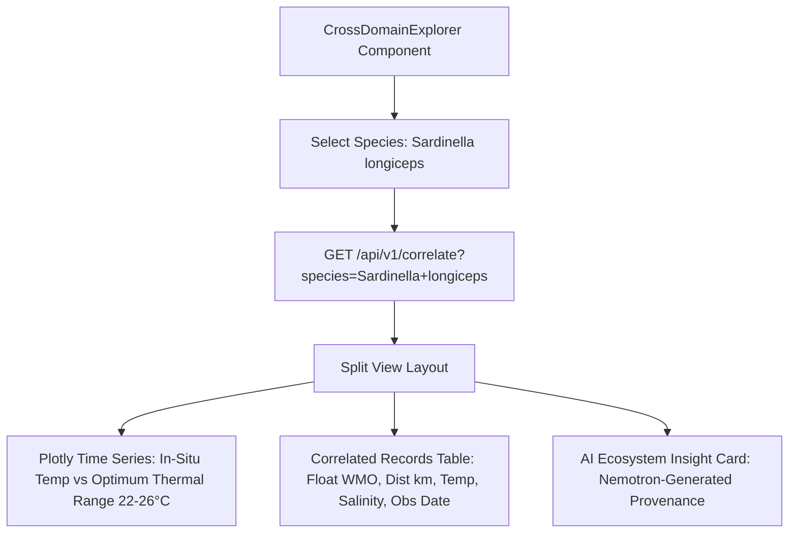

# Member 6: Kanishka Sahal (Marine Analytics & Presentation Lead)
**Role**: Marine Data Visualization Specialist & Presentation Lead  
**Focus Areas**: INCOIS ↔ CMLRE Cross-Domain Explorer, 15+ Oceanographic Plotly Scientific Charts, Otolith Morphometrics Visualizer, SIH Pitch Deck & Video Production  

---

## 1. Executive Summary & Ownership Boundaries
Member 6 is responsible for translating complex oceanographic and marine biological data into scientific visualizations and presentation deliverables:
1. **INCOIS ↔ CMLRE Cross-Domain Explorer (`CrossDomainExplorer.tsx`)**: Dedicated explorer demonstrating how physical ocean variables (temperature, salinity, oxygen) directly correlate with marine biodiversity distribution shifts and thermal stress.
2. **Scientific Chart Suite (`frontend/components/Charts/`)**: 15+ specialized oceanographic charts built with Plotly.js (Hovmöller depth-time diagrams, T-S diagrams with isopycnals, 3D surface profiles, BGC correlation scatter plots, WindRose, and seasonal boxplots).
3. **Filling Empty Chart Stubs**: Implementing `CrossCorrelogram.tsx`, `ObsDensityMap.tsx`, `ProfileCount.tsx`, and `QCHistogram.tsx`.
4. **SIH PPT Deck & Video Presentation**: Authoring the official 9-slide deck and 5-7 minute demonstration video following the exact narrative in the VARUNA Master Guide.

---

## 2. File Ownership & Code Contracts

### Primary Files Owned
- `frontend/components/CrossDomainExplorer.tsx` [NEW - INCOIS x CMLRE Explorer]
- `frontend/components/AnalysisHub.tsx` [MAINTAIN - Scientific chart dashboard]
- `frontend/components/Charts/` [MAINTAIN & COMPLETE ALL 15 CHART MODULES]
  - `TSIsopycnals.tsx`, `HovmollerDiagram.tsx`, `DepthProfile.tsx`, `Surface3D.tsx`, `AnomalySeries.tsx`
  - `CrossCorrelogram.tsx` [FILL STUB]
  - `ObsDensityMap.tsx` [FILL STUB]
  - `ProfileCount.tsx` [FILL STUB]
  - `QCHistogram.tsx` [FILL STUB]
- `docs/assignments/` & Presentation Slides [GOVERN & PRODUCE]

---

## 3. Technical Specifications & Implementation Blueprints

### 3.1 INCOIS ↔ CMLRE Cross-Domain Explorer (`CrossDomainExplorer.tsx`)

#### Component Logic:
- Displays public OBIS/GBIF records mapped to Darwin Core standard as realistic stand-in for CMLRE otolith/eDNA datasets.
- Renders environmental envelope: shaded background region showing species thermal tolerance vs recorded water temperature from nearest ARGO float profiles.
- Displays honest PoC badge: *"Demonstrated with OBIS/GBIF Indian Ocean public records. Architected for CMLRE national marine data backbone."*

---

### 3.2 Chart Modules & Plotly Specifications

#### 1. Temperature-Salinity Diagram with Isopycnals (`TSIsopycnals.tsx`):
- Computes UNESCO potential density $\sigma_\theta$ contours as background isopycnal curves.
- Plots potential temperature $\theta$ on y-axis ($^\circ\text{C}$) vs Practical Salinity $S_p$ on x-axis ($\text{PSU}$).
- Color-encoded by depth (pressure in dbar).

#### 2. Hovmöller Diagram (`HovmollerDiagram.tsx`):
- Time on x-axis (months), Depth on y-axis (0 to 2000m inverted), Color scale = Temperature or Oxygen.
- Interpolates profile grid using contour smoothing.

#### 3. Cross-Correlogram (`CrossCorrelogram.tsx`):
- $5 \times 5$ correlation matrix heatmap of $[T, S, \text{DOXY}, \text{CHLA}, \text{NITRATE}]$.

---

## 4. Daily Milestone & Deliverable Checklist (Aug 15 - Aug 24)

- [ ] **Day 1 (Aug 15)**: Build `frontend/components/CrossDomainExplorer.tsx` component layout and species selector.
- [ ] **Day 2 (Aug 16)**: Connect `CrossDomainExplorer.tsx` to `/api/v1/correlate` and render species-temperature envelopes.
- [ ] **Day 3 (Aug 17)**: Implement `CrossCorrelogram.tsx` and `ObsDensityMap.tsx` Plotly modules.
- [ ] **Day 4 (Aug 18)**: Implement `ProfileCount.tsx` and `QCHistogram.tsx` Plotly modules.
- [ ] **Day 5 (Aug 19)**: Ensure all 15 chart components in `AnalysisHub.tsx` render without modebars and use the dark ocean palette.
- [ ] **Day 6 (Aug 20)**: Finalize SIH 9-Slide Deck following the exact narrative in Master Guide Section 10.
- [ ] **Day 7 (Aug 21)**: Record high-resolution screen recordings of compound agent queries and anomaly feed.
- [ ] **Day 8 (Aug 22)**: Edit and assemble the 5-7 minute demonstration video (no faces, no university names, strictly professional).
- [ ] **Day 9 (Aug 23)**: Complete slide-by-slide rehearsal and timing checks.
- [ ] **Day 10 (Aug 24)**: Hackathon Kickoff & Presentation Delivery.
