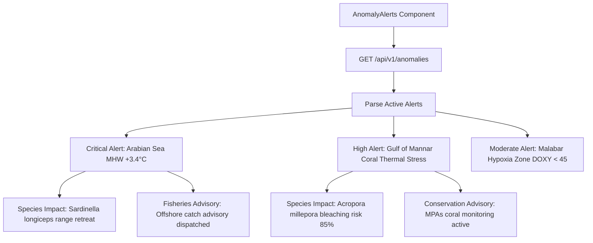

# Member 5: Netal Gupta (Geospatial Systems & Visualization Lead)
**Role**: Geospatial Engineer & Visualization Specialist  
**Focus Areas**: Mapbox GL JS & Deck.gl Geospatial Canvas, ARGO Float Fleet Trajectory Rendering, CMLRE Biodiversity Occurrence Layer, Proactive Anomaly Alert Center UI  

---

## 1. Executive Summary & Ownership Boundaries
Member 5 is responsible for the geospatial situational awareness center of VARUNA:
1. **Interactive Geospatial Canvas (`OceanMap.tsx`)**: High-performance WebGL Deck.gl multi-layer map rendering 3,800+ active ARGO floats, bathymetric contours, and marine basin boundaries.
2. **CMLRE Biodiversity Observation Layer**: Deck.gl `ScatterplotLayer` rendering species occurrence records with color-coded taxonomic groupings and radius scaled to individual count.
3. **Float Trajectory Visualization (`TrajectoryLayer.tsx`)**: 90-day to 365-day historical drift tracks using Deck.gl `PathLayer` with gradient depth/time encoding.
4. **Proactive Anomaly & Early-Warning Center (`AnomalyAlerts.tsx`)**: Dedicated situational awareness feed displaying active Marine Heatwave alerts, hypoxia zones, affected marine species, and fisheries policy advisories.

---

## 2. File Ownership & Code Contracts

### Primary Files Owned
- `frontend/components/OceanMap.tsx` [EXTEND - Deck.gl multi-layer support, species toggle]
- `frontend/components/AnomalyAlerts.tsx` [NEW - Proactive early-warning feed]
- `frontend/components/Map/FloatMap.tsx` [MAINTAIN - Interactive float marker inspector]
- `frontend/components/Map/TrajectoryLayer.tsx` [MAINTAIN - PathLayer drift tracks]
- `frontend/components/ui/DataStatusBar.tsx` [MAINTAIN - Live fleet telemetry bar]

---

## 3. Technical Specifications & Implementation Blueprints

### 3.1 Proactive Anomaly Alert Center (`frontend/components/AnomalyAlerts.tsx`)

The early-warning dashboard displays real-time ecological and physical anomalies flagged by the background Anomaly Agent:



#### Alert Card Data Structure:
```tsx
export interface AnomalyAlert {
  id: number;
  alert_type: "MARINE_HEATWAVE" | "HYPOXIA" | "CHLOROPHYLL_BLOOM" | "THERMAL_DISRUPTION";
  severity: "CRITICAL" | "HIGH" | "MODERATE" | "ADVISORY";
  ocean_basin: string;
  lat_range: [number, number];
  lon_range: [number, number];
  metric_value: number;       // e.g. +3.4 °C anomaly
  baseline_value: number;     // e.g. 28.1 °C climatological mean
  detected_at: string;
  affected_species: Array<{
    scientific_name: string;
    common_name: string;
    vulnerability_note: string;
  }>;
  policy_advisory: string;
}
```

---

### 3.2 Dual-Layer Geospatial Rendering (Deck.gl in `OceanMap.tsx`)

`OceanMap.tsx` renders simultaneous, hardware-accelerated layers:
1. **ARGO Float Fleet Layer**:
   ```typescript
   new ScatterplotLayer({
     id: 'argo-fleet-layer',
     data: floatData,
     getPosition: (d: any) => [d.last_lon, d.last_lat],
     getFillColor: [46, 230, 198, 200],  // Tropical Aqua
     getRadius: 8000,                    // 8km radius in meters
     radiusMinPixels: 4,
     radiusMaxPixels: 14,
     pickable: true,
     onClick: (info) => onSelectFloat(info.object)
   })
   ```
2. **CMLRE Biodiversity Layer (Toggleable)**:
   ```typescript
   new ScatterplotLayer({
     id: 'cmlre-biodiversity-layer',
     data: speciesData,
     getPosition: (d: any) => [d.decimal_longitude, d.decimal_latitude],
     getFillColor: (d: any) => getTaxonColor(d.phylum), // Coral=Pink, Fish=Cyan, Turtle=Emerald
     getRadius: (d: any) => Math.max(5000, Math.min(25000, d.individual_count * 2000)),
     radiusMinPixels: 5,
     radiusMaxPixels: 20,
     pickable: true,
     onClick: (info) => onSelectSpecies(info.object)
   })
   ```

---

## 4. Daily Milestone & Deliverable Checklist (Aug 15 - Aug 24)

- [ ] **Day 1 (Aug 15)**: Implement `frontend/components/AnomalyAlerts.tsx` UI skeleton with severity badges and glassmorphic cards.
- [ ] **Day 2 (Aug 16)**: Connect `AnomalyAlerts.tsx` to `/api/v1/anomalies` REST endpoint with auto-polling every 5 minutes.
- [ ] **Day 3 (Aug 17)**: Add CMLRE species observation layer toggle button to `OceanMap.tsx`.
- [ ] **Day 4 (Aug 18)**: Build Deck.gl `ScatterplotLayer` for species occurrences with custom taxonomic color scales.
- [ ] **Day 5 (Aug 19)**: Enhance `TrajectoryLayer.tsx` with animated gradient drift paths for tracked ARGO floats.
- [ ] **Day 6 (Aug 20)**: Implement interactive Map Tooltips displaying in-situ temperature, salinity, and species metadata on hover.
- [ ] **Day 7 (Aug 21)**: Add ocean basin boundary polygon outlines (Arabian Sea, Bay of Bengal, Gulf of Mannar).
- [ ] **Day 8 (Aug 22)**: Performance tuning: verify 60 FPS pan/zoom with 10,000 combined data points.
- [ ] **Day 9 (Aug 23)**: Cross-browser geospatial rendering validation (Chrome, Edge, Firefox, Safari).
- [ ] **Day 10 (Aug 24)**: Hackathon Kickoff & Live Map Defense.
