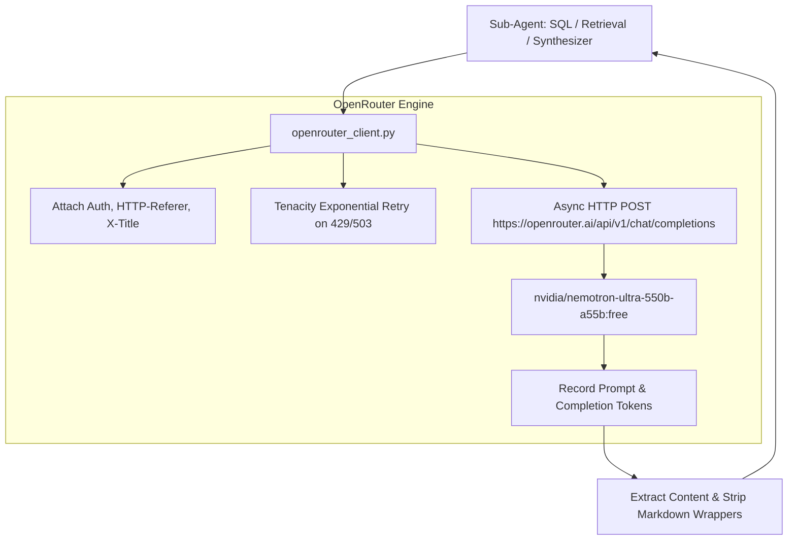

# Member 3: Sahil Shah (Backend AI & LLM Systems Lead)
**Role**: AI/LLM Systems Engineer & RAG Architect  
**Focus Areas**: OpenRouter Nemotron-Ultra 550B Integration, Zero-Local-LLM Architecture, Dual Qdrant Vector Indices, Schema-Linked NL→SQL Sub-Agent, Hybrid Retrieval & Re-ranking  

---

## 1. Executive Summary & Ownership Boundaries
Member 3 owns the model and cognitive layer of VARUNA:
1. **OpenRouter Client Infrastructure**: Production async HTTP client connecting to `nvidia/nemotron-ultra-550b-a55b:free`, eliminating all local Ollama/HuggingFace dependencies and latency blockers.
2. **NL→SQL Sub-Agent with Schema-RAG Context**: High-precision natural-language-to-SQL translation with PostgreSQL dialect awareness, PostGIS spatial predicates, and few-shot vector context injection.
3. **Dual Qdrant Vector Search Engine**: 
   - `argo_knowledge`: 768-dim profile summary embeddings for semantic exploratory search.
   - `argo_schema`: Schema table DDLs, column descriptions, and few-shot SQL exemplars for schema-linking.
   - `bio_knowledge`: Marine species taxonomy and ecological niche document embeddings.
4. **Conversation & Working Memory**: Redis-backed multi-turn conversation state manager with entity extraction and in-memory graceful degradation.

---

## 2. File Ownership & Code Contracts

### Primary Files Owned
- `backend/src/llm/openrouter_client.py` [NEW - Primary OpenRouter Client]
- `backend/src/llm/embedder.py` [UPDATE - Cloud embedder + deterministic vectorizer]
- `backend/src/llm/sql_gen.py` [MAINTAIN - Rule-based offline SQL fallback]
- `backend/src/chains/sql_rag_chain.py` [UPDATE - OpenRouter migration]
- `backend/src/chains/rag_chain.py` [UPDATE - OpenRouter migration]
- `backend/src/database/qdrant.py` [EXTEND - 3 collections support]
- `backend/src/rag/` [MAINTAIN - Retriever, Reranker, Context Assembler, Decomposer]
- `backend/src/memory/` [MAINTAIN - Conversation, Knowledge Graph, Temporal, Feedback]
- `backend/src/config.py` [UPDATE - OpenRouter settings]

---

## 3. Technical Specifications & Implementation Blueprints

### 3.1 OpenRouter Client Architecture (`backend/src/llm/openrouter_client.py`)



#### Code Contract (`openrouter_client.py`):
```python
from __future__ import annotations
import logging
from typing import Any, Dict, List, Optional
import httpx
from tenacity import retry, stop_after_attempt, wait_exponential, retry_if_exception_type
from src.config import settings

log = logging.getLogger(__name__)

OPENROUTER_URL = "https://openrouter.ai/api/v1/chat/completions"

class OpenRouterClient:
    def __init__(self):
        self.api_key = settings.openrouter_api_key
        self.model = settings.openrouter_model or "nvidia/nemotron-ultra-550b-a55b:free"
        self._client: Optional[httpx.AsyncClient] = None

    async def get_client(self) -> httpx.AsyncClient:
        if self._client is None or self._client.is_closed:
            self._client = httpx.AsyncClient(timeout=httpx.Timeout(30.0, connect=5.0))
        return self._client

    @retry(
        reraise=True,
        stop=stop_after_attempt(3),
        wait=wait_exponential(multiplier=1, min=1, max=10),
        retry=retry_if_exception_type((httpx.HTTPStatusError, httpx.TimeoutException))
    )
    async def chat_complete(
        self,
        messages: List[Dict[str, str]],
        temperature: float = 0.1,
        max_tokens: int = 4096,
        task_tag: str = "general"
    ) -> str:
        headers = {
            "Authorization": f"Bearer {self.api_key}",
            "HTTP-Referer": "https://varuna.incois.gov.in",
            "X-Title": "VARUNA Marine Intelligence Platform",
            "Content-Type": "application/json"
        }
        payload = {
            "model": self.model,
            "messages": messages,
            "temperature": temperature,
            "max_tokens": max_tokens
        }
        client = await self.get_client()
        resp = await client.post(OPENROUTER_URL, headers=headers, json=payload)
        resp.raise_for_status()
        data = resp.json()
        return data["choices"][0]["message"]["content"]
```

---

### 3.2 Schema-Linked NL→SQL Generation Engine

The SQL Generation Agent prompts Nemotron with:
1. **Target Schema**: Exact DDL of `public.marine_data` (with partitioned columns) and `public.marine_biodiversity`.
2. **Geospatial Reference Lexicon**: Bounding boxes for Indian Ocean basins:
   - Arabian Sea: `lat BETWEEN 5 AND 25`, `lon BETWEEN 45 AND 77`
   - Bay of Bengal: `lat BETWEEN 5 AND 25`, `lon BETWEEN 77 AND 100`
   - Gulf of Mannar: `lat BETWEEN 8 AND 10`, `lon BETWEEN 78 AND 80`
   - Equatorial Indian Ocean: `lat BETWEEN -5 AND 5`, `lon BETWEEN 45 AND 100`
3. **Safety Guidelines**:
   - `SELECT` queries only. Never `DROP`, `DELETE`, `UPDATE`, `INSERT`, `ALTER`.
   - Always include column aliases for human readability (`AS depth_m`, `AS temp_celsius`).
   - Limit all queries to maximum `500` rows unless aggregated with `GROUP BY`.

---

## 4. Daily Milestone & Deliverable Checklist (Aug 15 - Aug 24)

- [ ] **Day 1 (Aug 15)**: Implement `openrouter_client.py` and verify test completions with `nvidia/nemotron-ultra-550b-a55b:free`.
- [ ] **Day 2 (Aug 16)**: Update `sql_rag_chain.py` and `rag_chain.py` to route through OpenRouter instead of Ollama.
- [ ] **Day 3 (Aug 17)**: Implement `sql_gen_agent.py` and `retrieval_agent.py` specialized sub-agent wrappers.
- [ ] **Day 4 (Aug 18)**: Build the third Qdrant collection (`bio_knowledge`) for marine species habitat texts.
- [ ] **Day 5 (Aug 19)**: Enhance `retriever.py` with hybrid BM25 + dense vector fusion and Reciprocal Rank Fusion (RRF).
- [ ] **Day 6 (Aug 20)**: Validate zero-hallucination citation parser in `synthesizer_agent.py`.
- [ ] **Day 7 (Aug 21)**: Evaluate NL→SQL translation accuracy on 30 benchmark oceanographic queries.
- [ ] **Day 8 (Aug 22)**: Ensure Redis multi-turn session persistence and temporal recency decay.
- [ ] **Day 9 (Aug 23)**: End-to-end latency profiling (target < 2.0s for compound query execution).
- [ ] **Day 10 (Aug 24)**: Hackathon Kickoff & Defense.
