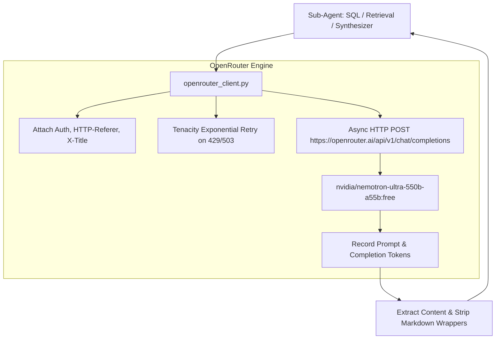

# Member 3: Sahil Shah (Backend AI & LLM Systems Lead)
**Role**: AI/LLM Systems Engineer & RAG Architect  
**Focus Areas**: OpenRouter Nemotron-Ultra 550B Integration, Zero-Local-LLM Architecture, Dual Qdrant Vector Indices, Schema-Linked NL→SQL Sub-Agent, Hybrid Retrieval & Re-ranking  

---

## 1. Executive Summary & Ownership Boundaries
Member 3 owns the model integration, RAG pipeline, vector search namespaces, and cognitive sub-agents for VARUNA:
1. **OpenRouter Client Infrastructure**: Production async HTTP client connecting to `nvidia/nemotron-ultra-550b-a55b:free`, eliminating all local Ollama/HuggingFace dependencies and latency blockers.
2. **NL→SQL Sub-Agent with Schema-RAG Context**: High-precision natural-language-to-SQL translation with PostgreSQL dialect awareness, PostGIS spatial predicates, and few-shot vector context injection.
3. **Dual Qdrant Vector Search Engine**: 
   - `argo_knowledge`: 768-dim profile summary embeddings for semantic exploratory search.
   - `argo_schema`: Schema table DDLs, column descriptions, and few-shot SQL exemplars for schema-linking.
   - `bio_knowledge`: Marine species taxonomy and ecological niche document embeddings.
4. **Conversation & Working Memory**: Redis-backed multi-turn conversation state manager with entity extraction and in-memory graceful degradation.

---

## 2. Work Allocation: What to Review vs. What to Build

### 🔍 What to REVIEW (Existing Code — Requires Heavy/High Critical Review)
1. **`src/memory/conversation.py` [HIGH REVIEW]**:
   - **Critical Flag**: Top-level `import redis` must be protected with `try/except ImportError` so the module never crashes in environments without Redis.
   - Verify Redis sliding window key expiration and in-process dictionary fallback mechanism.
2. **`src/llm/embedder.py` [HIGH REVIEW]**:
   - **Critical Flag**: Replace MD5 deterministic hash vectorizer with real embedding calls to OpenRouter (`nomic-ai/nomic-embed-text-v1.5:free`).
   - Keep the hash vectorizer strictly as an emergency offline testing utility.
3. **`src/chains/sql_rag_chain.py` & `rag_chain.py` [HEAVY REVIEW]**:
   - **Critical Flag**: Remove all legacy references to `ollama_client.py` and replace with `openrouter_client.py`.
   - Update prompt templates to align with Nemotron-Ultra 550B system formatting.
4. **`src/rag/retriever.py` & `src/database/qdrant.py` [HIGH REVIEW]**:
   - Extend Qdrant collection initialization to manage 3 distinct namespaces (`argo_knowledge`, `argo_schema`, `bio_knowledge`).
   - Validate BM25 + dense vector Reciprocal Rank Fusion (RRF) scoring math.
5. **`src/config.py` [HIGH REVIEW]**:
   - Verify `openrouter_model` defaults to `nvidia/nemotron-ultra-550b-a55b:free` and ensure all Ollama settings are marked as legacy fallbacks.

### 🔨 What to BUILD (New Code)
1. **`src/llm/openrouter_client.py` [COMPLETELY NEW - PRIORITY #1]**:
   - Production async httpx client connecting to OpenRouter chat completions API with `tenacity` exponential retry on 429/503 status codes.
   - Implements `chat_complete(messages, temperature, max_tokens, task_tag)` and `embed_text(texts)`.
2. **`src/agents/sql_gen_agent.py` [COMPLETELY NEW]**:
   - Sub-agent wrapper taking task parameters, retrieving few-shot schema examples from Qdrant, generating sanitized SQL, and executing on PostgreSQL.
3. **`src/agents/retrieval_agent.py` [COMPLETELY NEW]**:
   - Sub-agent wrapper querying both `argo_knowledge` and `bio_knowledge` collections and returning re-ranked passages.

---

## 3. Technical Specifications & Implementation Blueprints

---

## 4. Daily Milestone & Deliverable Checklist (Aug 15 - Aug 24)

- [ ] **Day 1 (Aug 15)**: Implement `openrouter_client.py` and verify test completions with `nvidia/nemotron-ultra-550b-a55b:free`.
- [ ] **Day 2 (Aug 16)**: Update `sql_rag_chain.py` and `rag_chain.py` to route through OpenRouter instead of Ollama.
- [ ] **Day 3 (Aug 17)**: Implement `sql_gen_agent.py` and `retrieval_agent.py` specialized sub-agent wrappers.
- [ ] **Day 4 (Aug 18)**: Build the third Qdrant collection (`bio_knowledge`) for marine species habitat texts.
- [ ] **Day 5 (Aug 19)**: Enhance `retriever.py` with hybrid BM25 + dense vector fusion and Reciprocal Rank Fusion (RRF).
- [ ] **Day 6 (Aug 20)**: Validate zero-hallucination citation parser in `synthesizer_agent.py`.
- [ ] **Day 7 (Aug 21)**: Evaluate NL→SQL translation accuracy on 30 benchmark oceanographic queries.
- [ ] **Day 8 (Aug 22)**: Ensure Redis multi-turn session persistence and temporal recency decay.
- [ ] **Day 9 (Aug 23)**: End-to-end latency profiling (target < 2.0s for compound query execution).
- [ ] **Day 10 (Aug 24)**: Hackathon Kickoff & Defense.
